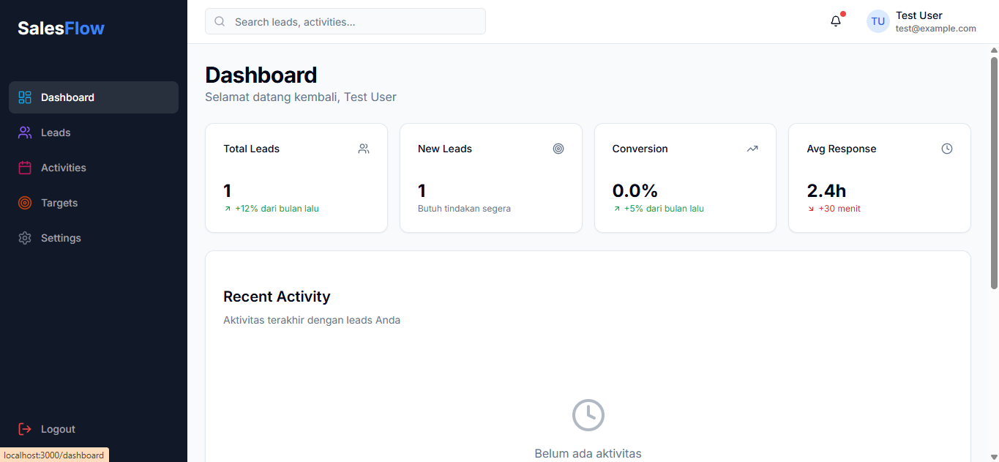
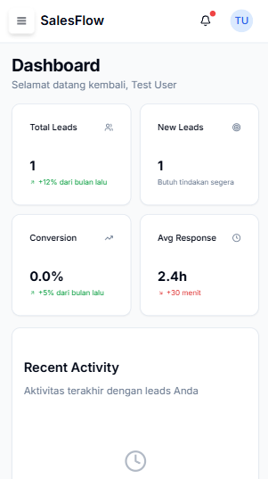
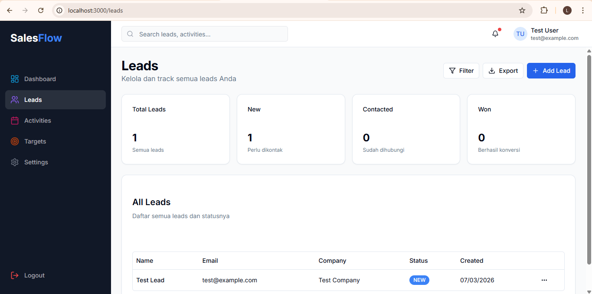
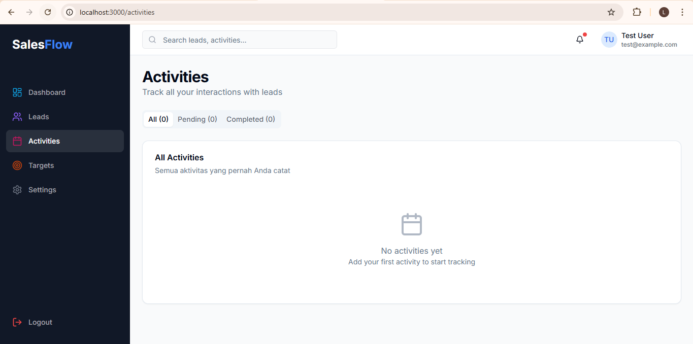
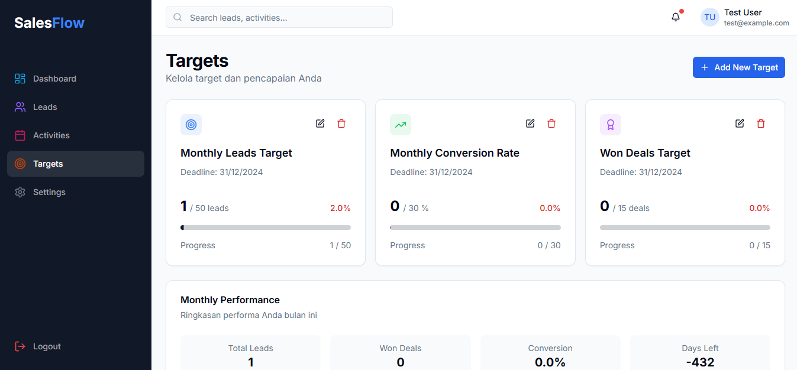
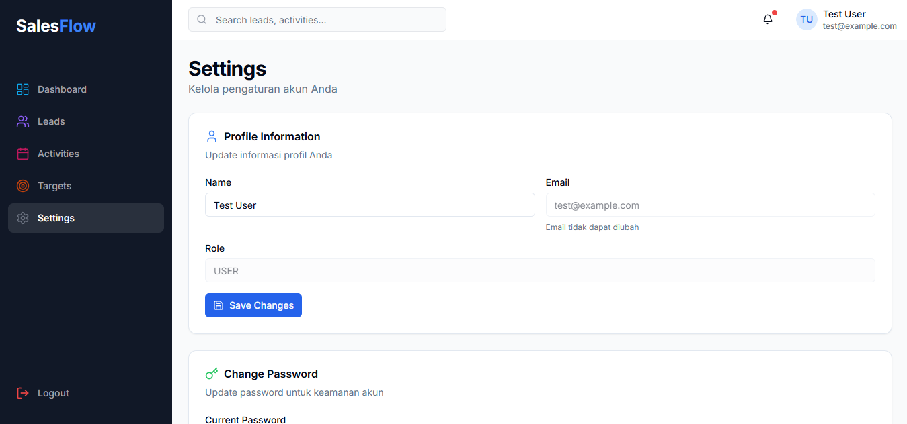

# SalesFlow CRM - Fullstack Next.js Portfolio Project


## ## 🚀 Live Demo: [https://salesflow-crm-lime.vercel.app](https://salesflow-crm-lime.vercel.app)

> A modern CRM built to help sales teams manage leads, track activities, and improve conversions. This project is designed as a portfolio piece to demonstrate fullstack development skills with cutting-edge technologies.

---

## 📋 Table of Contents

- [Key Features](#key-features)
- [Tech Stack](#tech-stack)
- [Database Architecture](#database-architecture)
- [Technical Challenges](#technical-challenges)
- [Screenshots](#screenshots)
- [Installation Guide](#installation-guide)
- [What I Learned](#what-i-learned)
- [Future Roadmap](#future-roadmap)
- [Contact](#contact)

---

## ✨ Key Features

### 🔐 **Authentication System**

- Login & Register with email
- Protected routes (pages accessible only after login)
- JWT session management
- Passwords hashed with bcryptjs

### 📊 **Interactive Dashboard**

- Real-time statistics: total leads, new leads, conversion rate
- Recent activity timeline
- Quick actions for fast access
- Fully responsive across all devices

### 👥 **Lead Management (CRUD)**

- Create, Read, Update, Delete leads
- Status pipeline: NEW → CONTACTED → QUALIFIED → LOST/WON
- Search and filter leads
- Lead details with complete information

### 📝 **Activity Tracking**

- Log every interaction: Call, Email, Meeting, Note
- Timeline per lead
- Due date with calendar picker
- Mark as complete / uncomplete
- Filter activities (pending/completed)

### 🎯 **Target Monitoring**

- Monthly target tracking
- Visual progress bars
- Target vs achievement comparison
- Monthly performance summary

### ⚙️ **User Settings**

- Profile editing
- Change password
- Notification preferences
- Danger zone (delete account)

### 📱 **Fully Responsive**

- Mobile-first design
- Sidebar with hamburger menu on mobile
- Tables with horizontal scroll on mobile
- Optimized for all devices (iPhone, Android, Tablet, Desktop)

---

## 🛠️ Tech Stack

### **Frontend**

| Technology       | Purpose                                   |
| ---------------- | ----------------------------------------- |
| **Next.js 14**   | App Router, Server Components, API Routes |
| **TypeScript**   | Type safety, easier maintenance           |
| **Tailwind CSS** | Fast and consistent styling               |
| **Shadcn UI**    | Beautiful reusable components             |
| **Lucide React** | Modern icons                              |
| **Date-fns**     | Date manipulation                         |

### **State Management**

| Technology          | Purpose                      |
| ------------------- | ---------------------------- |
| **Zustand**         | Lightweight state management |
| **TanStack Query**  | Data fetching & caching      |
| **React Hook Form** | Form handling                |
| **Zod**             | Data validation              |

### **Backend & Database**

| Technology              | Purpose                    |
| ----------------------- | -------------------------- |
| **Next.js API Routes**  | Serverless backend         |
| **Prisma ORM**          | Type-safe database queries |
| **Supabase PostgreSQL** | Production database        |
| **NextAuth.js**         | Authentication             |
| **Bcryptjs**            | Password hashing           |

### **DevOps & Tools**

| Technology       | Purpose         |
| ---------------- | --------------- |
| **Git & GitHub** | Version control |
| **Vercel**       | Deployment      |
| **ESLint**       | Code linting    |
| **Prettier**     | Code formatting |

---

## 🗄️ Database Architecture

```prisma
model User {
  id         String    @id @default(cuid())
  email      String    @unique
  password   String
  name       String?
  leads      Lead[]
  activities Activity[]
  createdAt  DateTime  @default(now())
  updatedAt  DateTime  @updatedAt
}

model Lead {
  id           String    @id @default(cuid())
  name         String
  email        String?
  phone        String?
  company      String?
  status       String    @default("NEW")
  assignedTo   User?     @relation(fields: [assignedToId], references: [id])
  assignedToId String?
  activities   Activity[]
  createdAt    DateTime  @default(now())
  updatedAt    DateTime  @updatedAt
}

model Activity {
  id          String   @id @default(cuid())
  type        String   // CALL, EMAIL, MEETING, NOTE
  title       String
  description String?
  lead        Lead     @relation(fields: [leadId], references: [id], onDelete: Cascade)
  leadId      String
  user        User     @relation(fields: [userId], references: [id])
  userId      String
  dueDate     DateTime?
  completed   Boolean  @default(false)
  createdAt   DateTime @default(now())
  updatedAt   DateTime @updatedAt
}
```

**Relationships:**

- User has many Leads (one-to-many)
- User has many Activities (one-to-many)
- Lead has many Activities (one-to-many)
- Cascade delete: when a lead is deleted, all its activities are automatically deleted

---

## 🧠 Technical Challenges

### 1. **Query Performance Optimization**

**Challenge:** With thousands of leads, queries can become slow.
**Solution:**

- Implemented pagination
- Prisma query optimization
- Database indexing

### 2. **Real-time Activity Tracking**

**Challenge:** Users need to see activity updates without refreshing.
**Solution:**

- Using TanStack Query for auto-refresh
- Optimistic updates for better UX
- Revalidation after mutations

### 3. **Responsive Tables**

**Challenge:** Lead tables are too wide for mobile screens.
**Solution:**

- Horizontal scroll on mobile
- Min-width 800px for table content
- Card layout alternative for mobile (in development)

### 4. **Authentication Flow**

**Challenge:** Session user.id was not readable in server components.
**Solution:**

- Workaround by finding user by email
- Proper JWT callbacks in NextAuth
- Type declarations for session

### 5. **Hydration Errors**

**Challenge:** Date format mismatch between server and client.
**Solution:**

- Using mounted state for client-only rendering
- suppressHydrationWarning for specific cases
- Consistent date formatting with date-fns

---

## 📸 Screenshots

### Desktop Dashboard



### Mobile Dashboard



### Leads Management



### Activity Timeline



### Targets Page



### Settings Page



---

## 🔧 Installation Guide

### Prerequisites

- Node.js 18+
- PostgreSQL (or Supabase account)
- Git

### Steps

```bash
# 1. Clone the repository
git clone https://github.com/myangga7/salesflow-crm.git
cd salesflow-crm

# 2. Install dependencies
npm install

# 3. Setup environment variables
cp .env.example .env.local
# Edit .env.local with your credentials

# 4. Setup database
npx prisma migrate dev --name init
npx prisma db seed

# 5. Run development server
npm run dev

# 6. Open browser
open http://localhost:3000
```

### Environment Variables

```env
# Database
DATABASE_URL="postgresql://..."

# NextAuth
NEXTAUTH_SECRET="your-secret-key"
NEXTAUTH_URL="http://localhost:3000"
```

---

## 📚 What I Learned

### Technical Skills

- **Next.js 14 App Router** - Server Components, Client Components, Layouts
- **TypeScript** - Type safety, interfaces, type declarations
- **Prisma ORM** - Schema design, migrations, relations
- **PostgreSQL** - Database design, indexing, queries
- **Authentication** - JWT, session management, protected routes
- **Responsive Design** - Mobile-first approach, media queries
- **State Management** - Zustand vs TanStack Query use cases

### Soft Skills

- **Problem Solving** - Debugging hydration errors, routing issues
- **Project Planning** - Feature prioritization, timeline management
- **Code Organization** - Maintainable folder structure
- **Documentation** - Writing clear README and comments

---

## 🗺️ Future Roadmap

### Version 1.0 (Completed) ✅

- [x] Authentication
- [x] Dashboard
- [x] Leads CRUD
- [x] Activity Tracking
- [x] Targets Page
- [x] Settings Page
- [x] Responsive Design

### Version 1.1 (Planned) 📅

- [ ] Import/Export Excel
- [ ] Advanced Search & Filter
- [ ] Email Notifications
- [ ] Dark Mode

### Version 2.0 (Future) 🚀

- [ ] Team Collaboration
- [ ] Real-time Updates (WebSocket)
- [ ] Mobile App (React Native)
- [ ] AI Lead Scoring

---

## 📞 Contact

**Name:** Angga  
**Email:** angga7nugraha@gmail.com  
**LinkedIn:** [https://www.linkedin.com/in/angga-n-96181157/](https://www.linkedin.com/in/angga-n-96181157/)  
**GitHub:** [github.com/myangga7](https://github.com/myangga7)

---

## 📝 License

MIT License - Feel free to use this project as inspiration or learning material.

---

## ⭐ Thank You!

If you like this project, please give it a star on GitHub! ⭐

[](https://github.com/myangga7/salesflow-crm)
[](https://github.com/myangga7/salesflow-crm)
[](https://github.com/myangga7/salesflow-crm)
